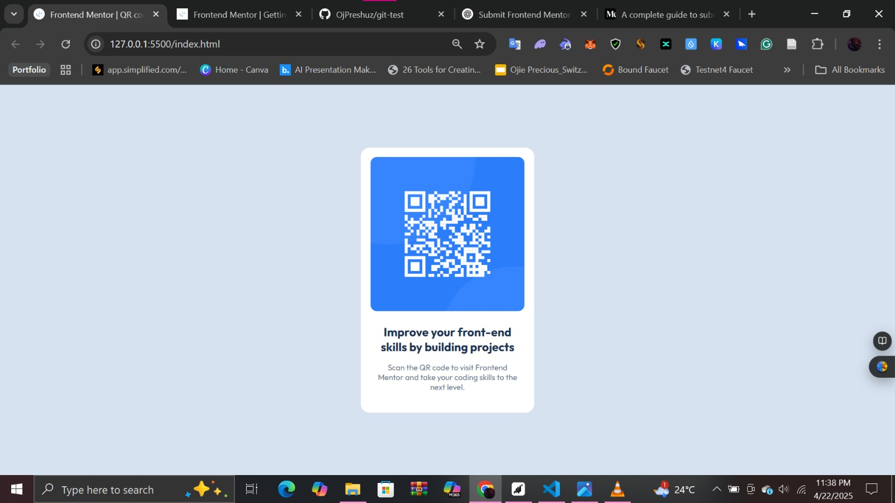

# Frontend Mentor - QR code component solution

This is a solution to the [QR code component challenge on Frontend Mentor](https://www.frontendmentor.io/challenges/qr-code-component-iux_sIO_H). Frontend Mentor challenges help you improve your coding skills by building realistic projects. 

## Table of contents

- [Overview](#overview)
  - [Screenshot](#screenshot)
  - [Links](#links)
- [My process](#my-process)
  - [Built with](#built-with)
  - [What I learned](#what-i-learned)
  - [Continued development](#continued-development)
  - [Useful resources](#useful-resources)
- [Author](#author)
- [Acknowledgments](#acknowledgments)

## Overview

### Screenshot

### Links

- Solution URL: [Add solution URL here](https://your-solution-url.com)
- Live Site URL: [Add live site URL here](https://your-live-site-url.com)

## My process

### Built with

- Semantic HTML5 markup
- CSS custom properties
- Flexbox
- CSS Grid

### What I learned

I learned how to effectively use CSS Grid and Flexbox to create responsive layouts, which improved my understanding of modern web design techniques. Additionally, I gained experience in structuring semantic HTML5, enhancing accessibility and SEO for my projects.

### Continued development

In the future, I plan to explore more advanced CSS techniques, such as animations and transitions, to enhance user experience. Additionally, I aim to improve my JavaScript skills to add interactivity to my projects.
Additionally, I would like to focus on improving my skills in responsive design and accessibility to ensure that my projects are usable for a wider audience.

### Useful resources
- [CSS Tricks](https://css-tricks.com/) - A great resource for learning CSS techniques and best practices.

## Author
- Twitter - [@ojpreshuz](https://www.twitter.com/ojpreshuz)

## Acknowledgments
Special thanks to my mentors and peers for their invaluable feedback and support throughout this project.

